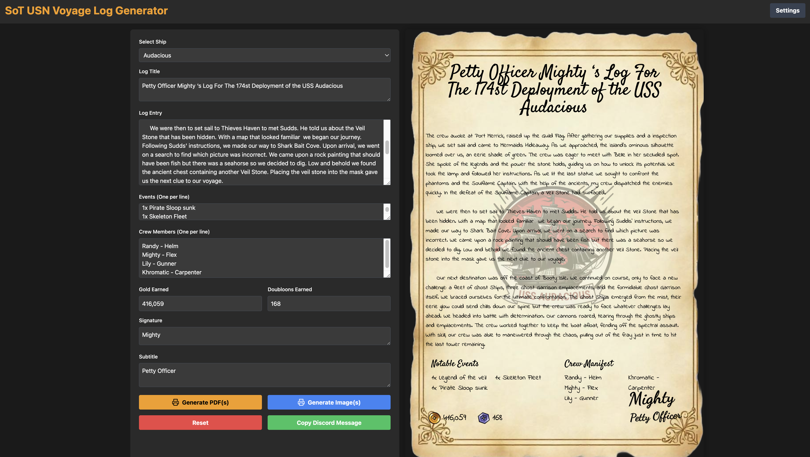

# USN Voyage Log Generator: Bringing Sea of Thieves Adventures to Life

As a proud member of the United States Navy (USN) guild in *Sea of Thieves*, I wanted to create a tool to make it easier for people to create logs for their voyages. Enter the **USN Voyage Log Generator**—, a tool designed by pirates, for pirates.

## Inspiration and Goals

The goal of the **USN Voyage Log Generator** was simple:

1. Make it easy for members to create beautifully formatted logs.
2. Incorporate our guild’s lore, aesthetics, and a touch of nautical charm.
3. Provide options for exporting logs as PDFs or images, ready to share on Discord.
4. Add an easy system to convert your logs into a Discord message.

## Features

### 1. **Customizable Voyage Logs**
   - **Ship Logos**: Choose from our fleet’s iconic ships (*Audacious*, *Odin*, *Tyr*, and *Thor*) to personalize each log.
   - **Custom Fonts**: Select from playful and script fonts like *Satisfy* and *Indie Flower* for a whimsical pirate aesthetic.
   - **Log Components**: Include details such as:
     - **Log Title and Subtitle**: Perfect for naming voyages and adding ranks or themes.
     - **Notable Events**: Record everything from epic naval battles to discovering cursed treasures.
     - **Crew Manifest**: Honor the pirates who sailed by your side.
     - **Gold and Doubloons Earned**: Bragging rights, quantified.
     - **Signature**: Add the captain’s name (or pseudonym) for authenticity.

### 2. **Preview and Pagination**
   - Logs can span multiple pages, with a smart pagination algorithm that respects the layout’s aesthetics.
   - Preview your logs in a visually styled parchment background with draggable and interactive elements.

### 3. **Export Options**
   - **PDF Export**: Generate logs as high-quality PDFs, with separate files for each page.
   - **Image Export**: Create shareable PNG snapshots of your logs for quick uploads to Discord or social media.

### 4. **Discord Integration**
   - Automatically generate formatted messages summarizing your voyage for quick sharing in guild channels.

### 5. **Autosave Functionality**
   - Your progress is saved in the browser, so you can pick up where you left off without losing your masterpiece.

## Challenges and Solutions

### **1. Pagination Logic**
Breaking long text into pages while maintaining a consistent and visually appealing layout was a key challenge. To solve this:
- I calculated character limits and line heights to split text into appropriately sized chunks.
- Overly long lines and single-page overflows were handled by enforcing page breaks and continuing content on the next page.

### **2. Multi-Page Export**
Exporting pages as PDFs or images required the use of libraries like `html2pdf` and `html2canvas`. 

## Technical Stack

The app was built using **React** with a focus on maintainability and scalability. Key libraries include:
- **`html2pdf.js`** and **`html2canvas`**: For high-quality file exports.
- **Lucide React**: For clean and modern iconography.
- **Tailwind CSS**: To streamline responsive and aesthetic styling.
