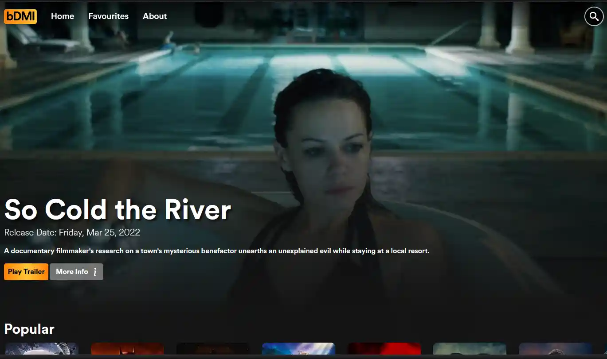
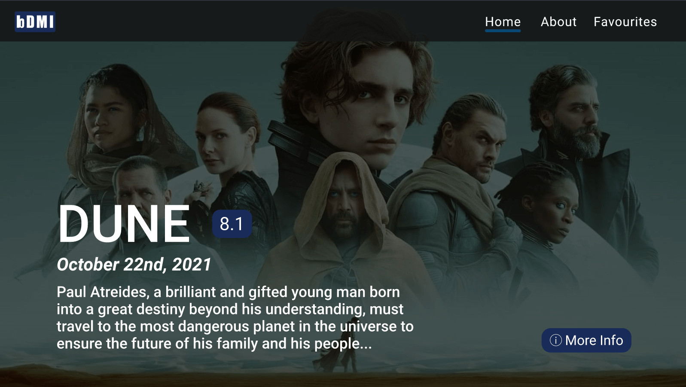
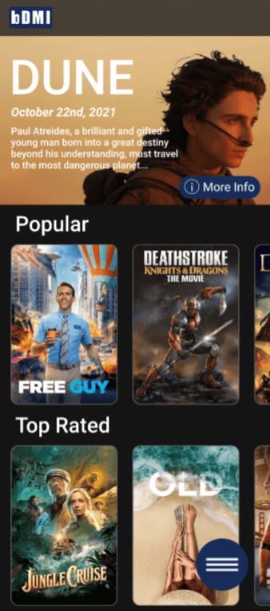
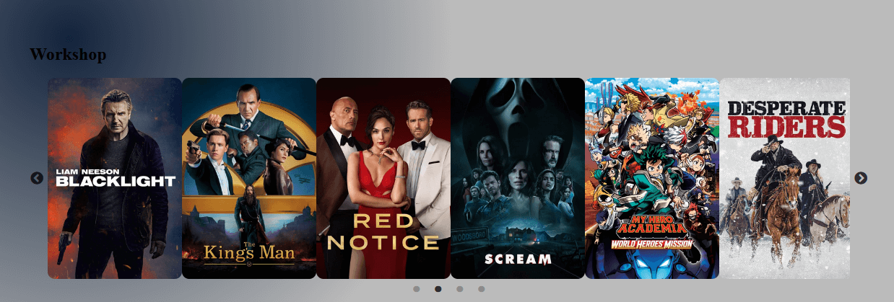
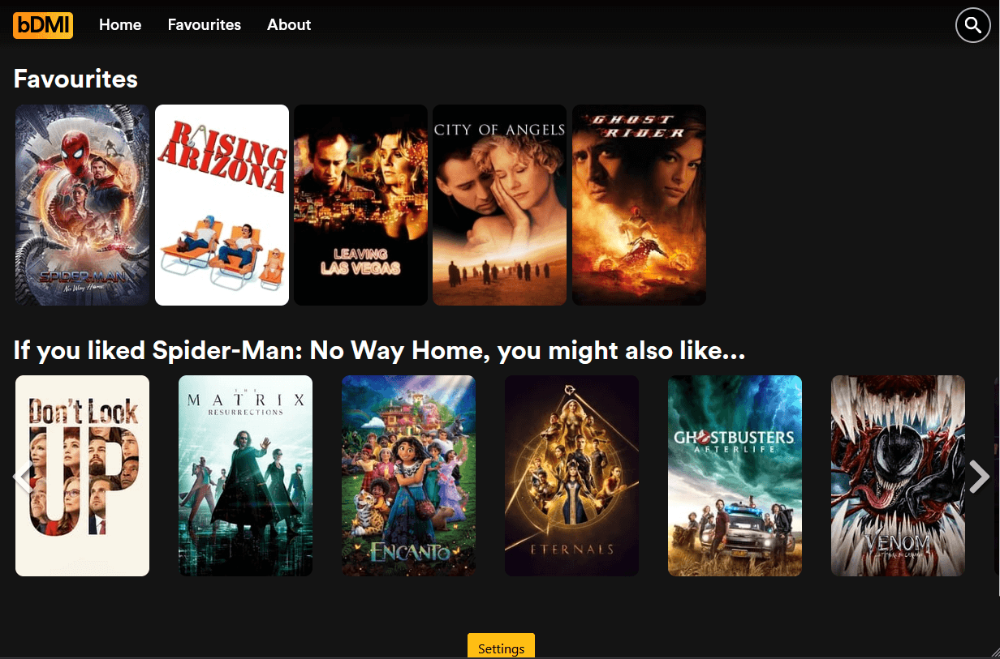
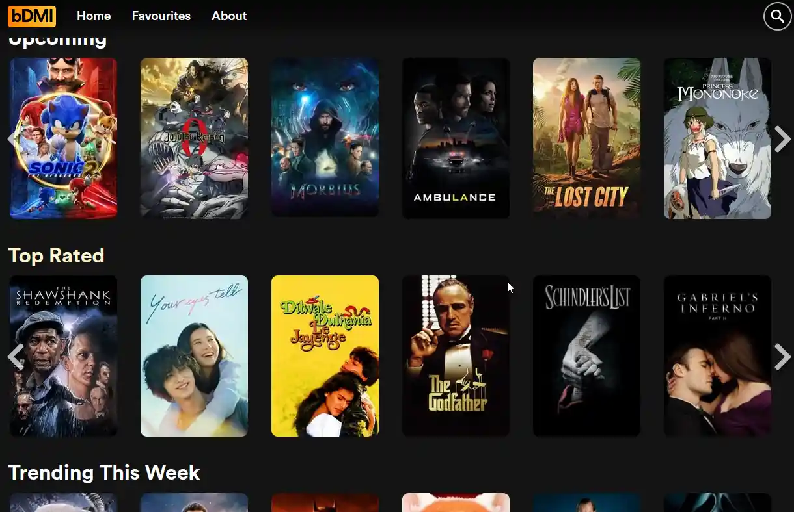

# Project Overview
A front end for users to query the [The Movie Database]("https://www.themoviedb.org/") API, and save favorite movies.

# Requirements

- User can add/remove Favorites
- Persistent saving of user's favorites
- Ability to see the following details of each movie:
  - Title
  - Release Date
  - Genre
  - RunTime
  - Summary
  - Rating
- Multiple categories
  - Popular
  - New Releases
  - Now Playing
  - Upcoming
- Ability to search for movies by title 

# Design

The project was developed in collaboration with [Ciaran McGuigan]("https://github.com/CiaranMcGuigan") and our final design ended up a mixture of our two prototypes we originally created separately.

<figure>

<figcaption>My Desktop prototype</figcaption>
</figure>

<figure>

<figcaption>My Mobile prototype</figcaption>
</figure>

We selected react-router to handle all the... routing, as well as bootstrap for icons, and slick to create swipe-able menus with movie image thumbnails.

# Development

We began with a simple workshop component, and wrote a quick test to make sure the slick gallery was working, and the API was returning data.



This project is somewhat large, so I'll highlight a few challenges we encountered during the development process, and how we overcame them.

## Reducing image sizes

We had some difficulties figuring out how to request the right sized images in order to lower the bandwidth requirements but still maintain good image quality.

We wrote a function in our API to retrieve the config data directly.

```js
const getConfigData = async () => {
  const response = await fetch(
    `https://api.themoviedb.org/3/configuration?api_key=${API_KEY}`
  );
  return response.json();
};
```

This helped us improve our src attributes when we generated images.

```html

```

This lowered the file size of each image from megabytes to kilobytes, which greatly improved load times.

## Minor Fixes

There were a number of minor issues, including movie date formats arriving in an initially difficult to use format, the need to retrieve random values from indexed movies, as well as preventing movies with missing data from being displayed on the front end.

We created a file called toolbelt.js which we used to house small functions which we deployed in many places within the codebase.

```js
const formatMovieDate = (rawMovieDate) => {
  const movieDateArray = rawMovieDate.split("-");
  const [year, month, day] = movieDateArray;
  let date = new Date(`${month} ${day} ${year}`);
  let options = {
    weekday: "long",
    year: "numeric",
    month: "short",
    day: "numeric",
  };
  return date.toLocaleDateString("en-us", options);
};

const generateRandomIndex = (arrayLength) => {
  // generate a random number between 0 and the 
  // total length of the array
  const index = Math.floor(Math.random() * arrayLength);
  return index;
};

const sanitizeVideoData = (videos) => {
  return videos.filter(
    (video) =>
      video.backdrop_path !== null &&
      video.poster_path !== null &&
      video.release_date !== undefined
  );
};

export { ... }
```

## Minimalistic Mobile Navigation

Since there were only 3 static pages (Home, Favourites, About) we elected to use a simple nav. In retrospect it would have been better if we could have found a way to display some text indicating where each link went, but I am still happy with the design.


This project was my first large project with SASS, and I made the cardinal sin of over indenting my styles and regretting it afterwards.

```css
.mobile-nav {
  position: absolute;
  .link {
    text-decoration: none;
    z-index: -1;
  }
  ul {
    padding: 0;
  }
  &.active {
    .nav-component:not(li) {
      transform: rotate(180deg);
    }
    .hamburger-menu {
      z-index: 10000;
      .hamburger-line {
        transform: rotate(45deg);
        margin-top: -2px;

        &::after {
          top: 0;
          background-color: $primary-color;
        }
        &::before {
          top: 0;
          transform: rotate(-90deg);
          background-color: $primary-color;
//   ... You get the idea
```

~~There were worse examples~~ This was definitely the worst one.

## Recommending Movies

One of our goals was to mimic a low tech implementation of recommending movies based on what the user had favourited. After digging through the API documentation we found an interface that supported this. So we selected a random favourite if the user had one, then used that to recommend additional content.



## Engage the Cage

But by and large the biggest problem with the site, **was the lack of Nicolas Cage movies.**

Wrote some custom API queries to find Nicolas Cage's actor ID, and used it to obtain all movie credits that reference him. We then added a toggleable setting for "Cage Mode" managed via React Context which would persist the setting in local storage.

```jsx
  useEffect(() => {
    if (settings.nicCageMode) {
      // NIC CAGE is 2963
      getMovieCreditsByActor(2963, settings.adultSearch)
        .then((data) => {
          const cageMovies = sanitizeVideoData(data.cast);
          setHeroMovie(cageMovies[generateRandomIndex(cageMovies.length)]);
          setCageMovies(cageMovies);
        })
        .catch((error) => console.log(error));
    } else {
      // we need to make sure a hero movie is set again
      setHeroMovie(upcomingMovies[generateRandomIndex(upcomingMovies.length)]);
    }
  }, [settings.nicCageMode]);
```

This would refresh the page, and load over 100+ Nic Cage movies on the home screen.



# Summary