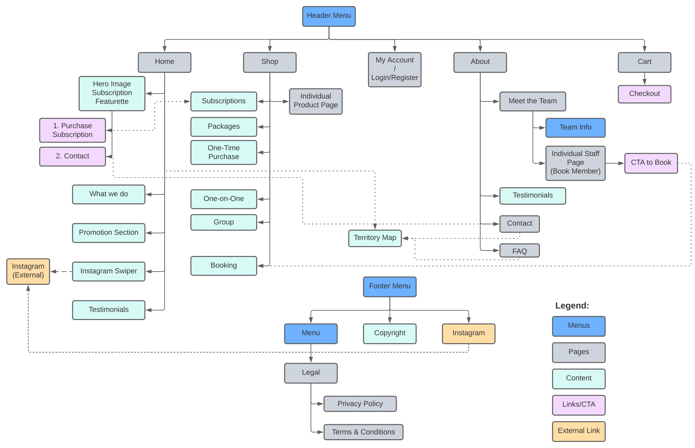

# Project Overview

A fully functional e-commerce website for a fictitious dog walking company. I took the role of project coordinator in a team of 4. Built on WordPress using Woo-Commerce.

## Requirements

We we're given a writeup to build our plan from, here is a summary of the client's requirements:
- E-Commerce
    - One time & recurring dog walking services
    - Discount packages
    - Ability to book date and time of walk
- Pages
    - About
        - Short bio for staff members
    - FAQ
    - Contact
- Components
    - Testimonials
    - Instagram
        - Embedded feed of latest photos
    - Territory Map
        - Map showing the area their walkers cover

## Design

Our design process went through several stages:

1. Requirements gathering and creation of Memo of Understanding
2. Content Plan & Information Architecture
3. Low Fidelity Prototype
4. Site Development Plan

### Memo of Understanding
- Researched competitors
- Categorization of client requirements into Pages, Components, and "Nice to have" features.

### Content Plan | Information Architecture

#### Content Plan

- Expanded on features to determine what content types and data each of our pages/components require.

Example:
- Home Page
    - Hero Card
        - Background image of dog walking
        - Text - Elevator Pitch to sell dog walking subscriptions
        - CTA buttons
            - Primary - Book Now
            - Secondary - Shop
    - 1 Featured Testimonial
        - Testimonial Text
        - Testimonial Author
    - What we do / Why use us
        - Image - clipart 
        - Heading - point 1
        - Text - short description

#### Information Architecture
- Created a diagram to illustrate the relationship between the pages & components of the site.

### Low Fidelity Prototype
- Mobile first prototype

<video title="Low fidelity prototype" style="width: auto; height:auto;" autoplay loop muted>
<source src="fetchPrototype.mp4" type="video/mp4">
</video>

### Site Development Plan

- Researched necessary plugins
- Created schemas for all custom post types, taxonomies, and ACF data.

Example: Custom Post Types

Staff
- Post Type Key: fetch-staff
- Post Type Label: Staff
- Rewrite Slug: staff
- Supports: Title
- Block Template: n/a
- Post Type Items: Jane Doggerson,
    Matthew Wooferton, Benjamin Poodlesberg, etc. 

## Development

Project is still in progress... Expect updates soon! :D