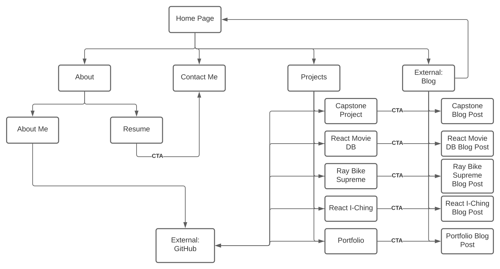

<video title="Showcasing the responsive design of my portfolio, from mobile to desktop view" style="width: 100%; height:auto;" autoplay loop muted>
<source src="portfolioResponsive.mp4" type="video/mp4">
</video>

*I heard you like portfolios so I put a portfolio inside your portfolio \#wowsometa \#just90skidsthings*

# Project Overview
Ubuntu inspired. Come for the monke, but stay for the active window management algorithm. Built in React, with React-Router, Markdown-To-JSX, and React-Syntax-Highlighter.

## Requirements
I already had begun cataloging my projects over on my [blog](https://blog.randygulak.com), which uses markdown files to create posts. I originally built that blog off a gatsby template, so while I had no idea how the markdown conversion was happening under the hood - I knew I wanted to replicate it here. That way, my blog posts would be reusable components on both my blog and portfolio.

Basic requirements were:
- Responsive & Mobile first
- Markdown based "posts"
- Simulate the feel of a linux GUI environment
- Minimum Pages
    - About
    - Contact
    - Projects
        - 4 school projects, 1 personal project
- Ability to embed code snippets with syntax highlighting

## Design

I went through several stages of wireframes & prototypes. 

### Wireframe

<video title="low fidelity wireframe" style="width: auto; height:auto;" autoplay loop muted>
<source src="wireframePortfolio.mp4" type="video/mp4">
</video>

### High Fidelity Prototype
<video title="high fidelity prototype" style="width: auto; height:auto;" autoplay loop muted>
<source src="prototypePortfolio.mp4" type="video/mp4">
</video>

### Content Plan & Site Map

A content plan was created breaking down the pages & components into their base elements.

Example: 
Projects Page
    - Top Bar
    - Projects will contain the following subpages:
        - Capstone Project
        - bdmi - React Movie Database
        - Ray Bike Supreme
        - I-Ching Divination React App
        - Portfolio
    - There will be an internal menu which handles navigation between projects
    - Each project subpage will follow the same schema:
        - Animated Image of the application (if there is movement to showcase)
        - Title
        - Link to view the live project
        - Github Repository Link
        - Requirements
        - Design Considerations
        - Code Overview
        - Summary

Site Map:


My original plan was for my projects to link directly to the corresponding blog post, but later on was refactored to display the markdown directly in the portfolio.

## Development

Early in development I receieved some useful feedback from my instructor at BCIT that my idea of having multiple navigation menus, as well as trying to maintain the same UI at the mobile level as I intended at desktop breakpoints was not in line with UX best practices. 

So I went back to the drawing board, and decided I would make the mobile design look like an android smart phone, then switch to the linux aesthetic at larger breakpoints. 

The biggest challenge I encountered at the outset was coming up with a way to support the dual functionality my site required:

1. On mobile, each "app" needs to be openable one at a time.
2. On desktop, it needs to be able to open multiple apps simultaneously, with movable and independently closable windows.

I had to find a way to support both use cases without writing the site twice. My original plan used react router and url paths, but I quickly realized that would not support launching multiple apps at once. 

I found I could use the `useSearchParams` hook to create an array of open "apps" which solved my routing problem.

<video title="Experimenting with useSearchParams" style="width: auto; height:auto;" autoplay loop muted>
<source src="searchParamsExperiment.mp4" type="video/mp4">
</video>

With R&D out of the way, I got to work.

### App Control

All the data for the site lives in appsData.js, this seemed the most efficient approach given the overall small scope of the project. 

Each navigation point within the site has the following schema (with some exceptions):

```jsx
{
    id: "fetch",
    external: false,
    // whether it navigates to another site, or within the site
    title: "Fetch",
    icon: fetchIcon,
    liveLink: "https://fetch.bcitwebdeveloper.ca/",
    // if it is a project, it links to the live site
    gitHubLink: "",
    component: <Post appId="fetch" postName={"fetch"} />,
}
```

These objects get used to both render icons and links on the site, but also is how I associate the url search params to the corresponding component.

I use two pieces of state:
1. searchParams (to track the URLs) 
2. activeApps (array of components)

I wrote a launchApp method, which takes in the appData object and adds the id to the array of searchParams. 

```jsx
  const launchApp = (appData) => {
    // if the app is already active, focus it
    if (activeApps.find((app) => app.props.appData.id === appData.id)) {
      focusApp(appData.id);
    }

    // Update the URL to reflect the appId
    const filteredSearchParams = searchParams
      .getAll("app")
      .filter((app) => app !== appData.id);
    // By filtering out the appId, we can
    // ensure that the app is not launched twice
    const newSearchParams = [...filteredSearchParams, appData.id];
    setSearchParams({ app: newSearchParams });
  };
```
Next I wrote a useEffect that runs every time searchParams is updated, which iterates over the array and if it finds a matching app component, adds it to activeApps array.

```jsx
  useEffect(() => {
    // ... abbreviated ...
    const allApps = [...projects, ...navigation, ...vsCodeBrowser];
    // now I do a for loop over the searchParams to see which apps are active
    const appsToShow = [];
    for (let index = 0; index < searchParams.getAll("app").length;
    index++) {
      const appId = searchParams.getAll("app")[index];
      const matchingApp = allApps.find((appData) => appData.id === appId);
      if (matchingApp) {
        appsToShow.push(
          <AppWindow
            launchApp={launchApp}
            closeApp={closeApp}
            focusApp={focusApp}
            appData={matchingApp}
            key={appId}
          >
            {matchingApp.component}
          </AppWindow>
        );
      }
    }
    setActiveApps(appsToShow);
  }, [searchParams]);
```

Each app renders as 1 main component, with 2 nested subcomponents:
- AppWindow - controls window movement
    - Post - renders markdown as html
    - AppMenu - contains additional project links

### AppWindow

In order to make this component functional for both mobile and desktop, I needed to write a useEffect that toggled whether or not the windows could be dragged depending on the size of the viewport. 

```jsx
  // Checks on every resize event to see if
  // draggable windows should be enabled
  useEffect(() => {
    const handleResize = () => {
      if (window.innerWidth < 850) {
        setDraggable(false);
        // remove all inline styles on the appWindow
        appWindowRef.current.removeAttribute("style");
      } else if (window.innerWidth > 850) {
        setDraggable(true);
      }
    };
    window.addEventListener("resize", handleResize);
    // Call it once so it also fires on first render.
    handleResize();
    return () => {
      window.removeEventListener("resize", handleResize);
    };
  }, []);
```

Then came the logic required to make windows draggable. After looking at some libraries I could use, I figured I may as well learn to do it myself. 

I used 3 pieces of state, and 1 ref. I only wanted windows to be draggable when the user clicks on the header, but I needed to reference the entire window when calculating position. 

I wrote 3 methods, startDrag, handleDrag, and endDrag

```jsx
  const startDrag = (e) => {
    if (!draggable) {
      return;
    }
    e.preventDefault();
    // e.screenX and screenY represent where the mouse is on the screen
    // i use the ref to get the position of the appWindow
    const { left, top } = appWindowRef.current.getBoundingClientRect();
    // i use the mouse position relative to the appWindow to get the offset
    const offsetX = e.screenX - left;
    const offsetY = e.screenY - top;
    setPositionDiff({ x: offsetX, y: offsetY });

    setDragging(true);
  };

  const handleDrag = (e) => {
    if (!draggable) {
      return;
    }
    if (dragging) {
      let left = e.screenX - positionDiff.x;
      let top = e.screenY - positionDiff.y;
      // if the appWindow is dragged off the screen, it will be moved back
      if (left < 100) {
        // stops before the side navigation
        left = 100;
      }
      if (top < 30) {
        // stops before the header on the top of the viewport
        top = 30;
      }
      if (left > window.innerWidth - appWindowRef.current.offsetWidth) {
        // stops at the right side of the screen
        left = window.innerWidth - appWindowRef.current.offsetWidth;
      }
      if (top > window.innerHeight - appWindowRef.current.offsetHeight) {
        // stops at the bottom of the screen
        top = window.innerHeight - appWindowRef.current.offsetHeight;
      }
      appWindowRef.current.style.left = `${left}px`;
      appWindowRef.current.style.top = `${top}px`;
    }
  };

  const endDrag = () => {
    if (!draggable) {
      return;
    }
    setDragging(false);
  };
```

### Post

I use the postName variable from my appsData schema to obtain the right filepath to the relevant markdown file. The markdown-to-jsx library worked great and blended well with the Syntax highlighter. I created a few custom components to handle some edge cases, as well as to get proper pathing to assets in my public folder for images and videos. 

```jsx

const Code = ({ children, className }) => {
  SyntaxHighlighter.registerLanguage("jsx", jsx);
  SyntaxHighlighter.registerLanguage("json", json);
  // i need to run a split on the className prop to get the language
  // in the proper format for styles to kick in
  const language = className ? className.split("lang-")[1] : "";
  return (
    <SyntaxHighlighter
      showLineNumbers
      className={className ? className : "inline-code"}
      // if there is no className passed in, i default to inline-code
      // which I use for rendering `single lines` in code styling.
      language={language}
      style={materialDark}
    >
      {children}
    </SyntaxHighlighter>
  );
};


const Img = (props) => {
  return (
    
  );
};


const Source = (props) => {
  return (
    <source src={`$.../markdown/${props.postName}/${props.src}`}
    type="video/mp4"/>
  );
};

const Post = ({ appId, postName }) => {
  const [postContent, setPostContent] = useState("");
  const appData = appsData.projects[appId];
  useEffect(() => {
    import(`../../../public/markdown/${postName}/${postName}.md`).then(
      (post) => {
        fetch(post.default)
          .then((response) => response.text())
          .then((text) => setPostContent(text))
          .catch((error) => console.log(error));
      }
    );
  }, []);

  return (
    //   ... abbreviated ...
      <Markdown
        className="post-content"
        options={{
          overrides: {
            code: {
              component: Code,
            },
            img: {
              component: Img,
              props: { postName: postName },
            },
            source: {
              component: Source,
              props: {postName: postName}
            }
          },
        }}
      >
        {postContent}
      </Markdown>
  );
};
```

### Tracking the active App

I wrote a method that loops over all the currently loaded app-windows,
and compares it to the id of the appwindow the user clicked on, or just launched. It assigns a class of active and a high z-index to the matching app, while removing the class and setting all other apps to a lower z-index.

```jsx
  const focusApp = (appId, e) => {
    // After much experimenting with refs, I found vanilla JS to be the
    // only implementation that worked based on my current code structure
    // Not the best solution, but it gets the job done
    const appElements = document.querySelectorAll(".app-window");
    // I use Array.prototype as this method has the greatest browser support
    Array.prototype.forEach.call(appElements, (appElement) => {
      if (appElement.id === appId) {
        appElement.style.zIndex = "10000";
        appElement.classList.add("active")
      } else {
        appElement.style.zIndex = "9999";
        appElement.classList.remove("active")
      }
    });
  };
```
It also re-focuses any already open apps if you click the icon from the navigation, neat!

<video title="active App switching" style="width: 100%; height:auto;" autoplay loop muted>
<source src="activeApps.mp4" type="video/mp4">
</video>


### BONUS: VS-Code Embed

I found an open source project called [github1s](https://github.com/conwnet/github1s) which supports embedding a read-only vs code client as an iframe. I added a VS-Code component which takes in the URL as a parameter and renders it inside an AppWindow.


<video title="github1s embed running on the site" style="width: 100%; height:auto;" autoplay loop muted>
<source src="vsCodeEmbed.mp4" type="video/mp4">
</video>

## Summary

I'm really happy with how this turned out! I pushed myself and learned a lot in the process. Setting up simple experiments to prove the approach I wanted to take to myself before going all in helped me avoid costly mistakes. I think the way I structured my app data in retrospect could have been made much simpler, in the future I may investigate ways I could refactor this to improve performance. 