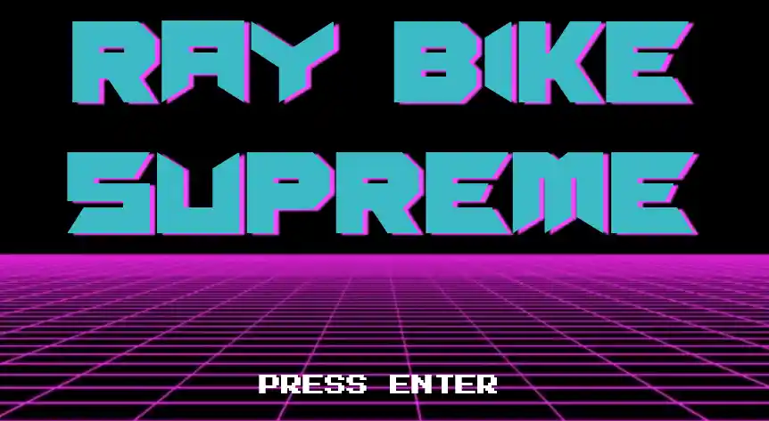
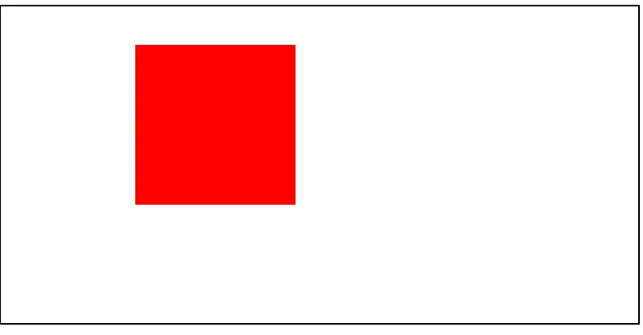
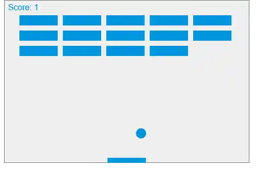
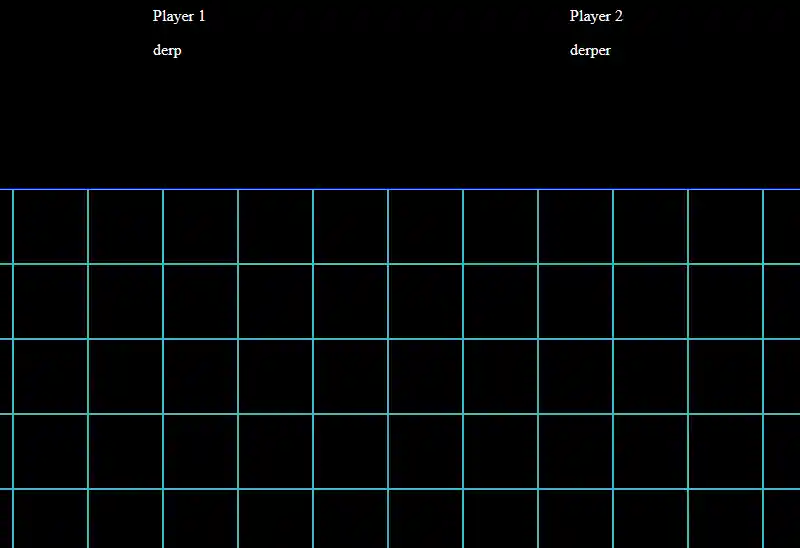
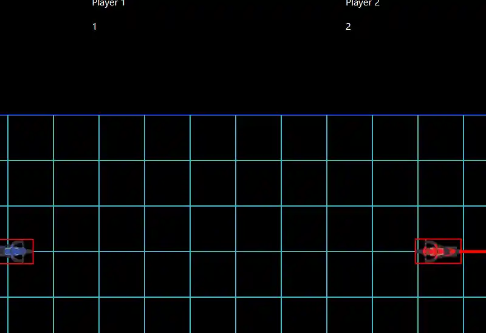
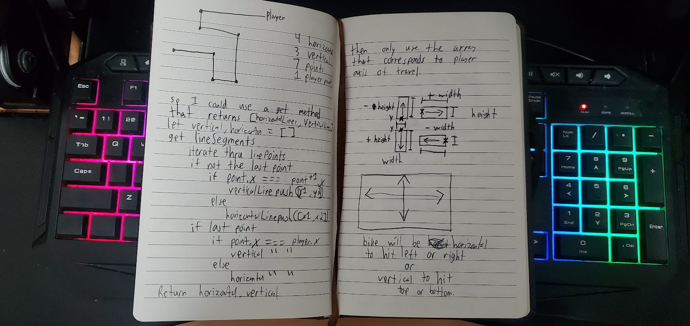
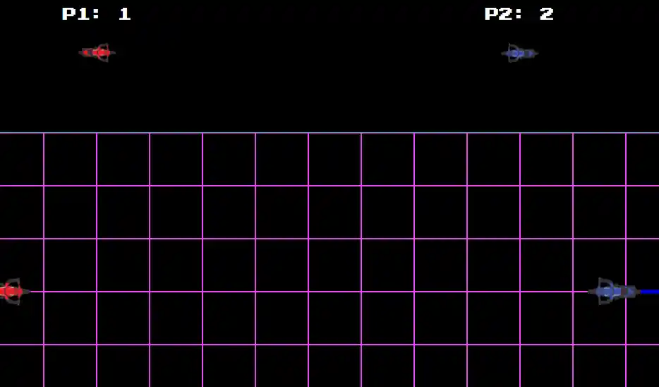

# Project Overview
A tron inspired 2d arcade game, written in vanilla JavaScript via the canvas API.

# Requirements
- 2 Player game
- Multiple rounds
- Players can enter their name and select a bike color
- Difficulty options (normal bike speed or faster)
- Keyboard controls
- Players lose by hitting eachother, an energy wall, or the outer game boundary
- Game will have end credits
- How to Play / Help Section

# Design
Design proceeded through several stages:
## 1. High level game description & Design statement

Ray Bike Supreme is a fast paced and action packed thrill ride set in a cyberpunk future where players duke it out on their hover-cycles in the metaverse. Two players at a time battle in an arena, leaving deadly energy walls trailing behind their hover-cycles; which if hit are a one hit K.O.! Players collect shield power ups, use boosts, and avoid obstacles while battling in either single matches or tournament mode. With 3 difficulty modes, and randomly generated obstacles, Ray Bike Supreme has a lot of replayability!

## 2. Play by Play description of the user experience

### Start up
-   when the game first start-up to the start screen the player will input their name and click to select the difficulty level and match type
-   A wicked sick guitar rift will also play during start-up and the title will have cool animations
-   each player will input their name
-   once two player have joined, they can click the start game button

### Bike Selection
-   Next, the hover-bike selection screen appears where each player selects their hover-bike

### Gameplay!
-   the game screen launches
-   The grid and hover-bike for both player appears on screen. the grid-size growing or shrinking depending on the difficulty level selected, as well as rendering obstacles. a HUD displays each player count of shield powerups and amount of boost
-   There are also help and quit buttons
-   the game countdown starts from 3 and then both player start controlling their hover-bike
-   as the hover-bike move through the grid they emit a energy-wall behind them, while players can move in 4 directions and boost around the grid using the keyboard controls trying to trap the other player into hitting a energy-wall, they also seek out shield powerups which allow them to temporarily pass-through an energy-wall
-   if a player hitting a obstacles or energy-wall the round is over. Best 2 out of 3 round determines the winner and goes to the game over screen
-   from there player can play again or quit

## 3. Distilling play by play into "ingredients":
1. DOM Elements (visible elements)
- div.game-container
 - div.start-screen
  - input#player-name
  - h1#game-title
  - button#add-player
  - select.difficulty-select
  - audio#start-theme
  - ul.players-joined
  - li.player
  - button#start-bike-select
 - div.bike-select-screen
  - img.hover-bike-blue
  - img.hover-bike-red
  - img.hover-bike-green
  - ul.players-joined
  - li.player
  - button#start-game
 - div.game-screen
  - div.hud
  - button.help
  - button.quit
  - div.player-1
	  - h3.player-boost
	  - h3.player-shield-count
  - div.player-2
	  - h3.player-boost
	  - h3.player-shield-count
  - canvas.game-grid
 - div.help-screen
  - p.game-description
  - p.controls
 - div.game-over-screen
  - h2.game-over-text
  - button.quit
  - button.play-again

2. Logic Elements (invisible elements)
	- class Player(name)
		- this.name
		- this.boost = Integer
		- this.powerups = []
		- this.isAlive = true
		- this.isShielded = false
		- this.activeLine
		- this.location = [x, y]
		- this.lineColor
		- this.playerBike
		- this.bikes = [redBike, blueBike, greenBike]
		- setPlayerBike(bike)
		- useBoost()
		- usePowerUp()
		- moveUp()
		- moveRight()
		- moveDown()
		- moveLeft()

	- object game
	  - obstacles = [will contain starting obstacles, then add player lines as drawn]
	  - screens = start-screen, bike-select-screen, game-screen, game-over-screen, help-screen
	  - audio = SickGuitarRift.mp3, gameTheme.mp3
	  - players = []
	  - difficultyLevel = easy || hard
	  - matchType = normal || tournament
	  - startGame()
	  - resetGame()
	  - helpPopup()
	  - gameOver()
	  - switchScreen(screen)
	  - setDifficulty(difficulty)
	  - setMatchType(match)
	  - addPlayer(name)
	  - canvasFunctions
	  - drawGame()
	  - spawnPowerUps()
	  - clearGrid()
	  - drawGrid
	  - drawPlayers()
	  - drawObstacles()
	  - addObstacle(x, y)
	  - checkCollisions()
	  - checkCollectPowerUp()
		

# Development
I typically begin my projects by constructing a "Workbench" where I can quickly prototype small components of code while I improve my understanding of the underlying API/Libraries I will be using. 

A single html file with a style tag, a script tag and some html allows me to control logic, content and presentation without jumping around into different files.

I had never used the canvas API before, so I had a lot of experimenting to do.

```html

<!DOCTYPE html>
<html lang="en">
  <head>
    <meta charset="UTF-8" />
    <meta http-equiv="X-UA-Compatible" content="IE=edge" />
    <meta name="viewport" content="width=device-width, initial-scale=1.0" />
    <title>Workbench</title>
    <style></style>
  </head>
  <body>
    <canvas id="canvas"></canvas>
  </body>
  <script defer>
    const canvas = document.getElementById("canvas");
    canvas.height = 400
    canvas.width = 800
    const ctx = canvas.getContext("2d");
    ctx.fillStyle = "green";
    ctx.fillRect(10, 10, 150, 100);
    ctx.lineWidth = 4
    ctx.strokeRect(0, 0, ctx.canvas.width, ctx.canvas.height)
  </script>
</html>
```

Things began rather humbly...


I followed the [MDN Canvas Breakout Tutorial](https://developer.mozilla.org/en-US/docs/Games/Tutorials/2D_Breakout_game_pure_JavaScript) to wrap my head around the canvas API.



I figured out how to draw a grid, and got some basic movement and controls implemented.



I imported my bike images, and got basic line drawing complete. i also created "debug" hit boxes to help me understand the collision detection as I worked out how to implement it.



Working through the collision detection algorithm was without a doubt the biggest challenge of the entire project. 



Each players `move()` method would calculate it's potential next position of x y coordinates, and then runs a `checkBounds(newX, newY)` method as well as a `checkObstacles(newX, newY)` method. If after both methods the players isAlive property remains true, the player moves; otherwise the `die()` method is called.

Checking the outer boundaries was fairly straight forward, however all the collision detection in this game was made considerably harder by my early decision to make the players rectangular rather than perfect squares. I wound up writing switch statements to account for the players current direction when making my calculations.

```js

  checkBounds = (newX, newY) => {

    switch (this.direction) {
      case UP:
        if (newY - this.height < 0) {
          this.die();
        }
        break;
      case RIGHT:
        if (newX + this.height > canvas.width) {
          this.die();
        }
        break;
      case DOWN:
        if (newY + this.height > canvas.height) {
          this.die();
        }
        break;
      case LEFT:
        if (newX - this.height < 0) {
          this.die();
        }
        break;
      default:
        break;
    }
  };

```

Checking for obstacles however took me several weeks of iterative improvements before I finally captured all edge cases.  I found that writing complex logical comparisons and capturing their true/false value in variable names helped me to write code that was more readable to me, which made some of the more complex calculations a little easier for me to work with.

```js
  checkObstacles = (newX, newY) => {
    let bikeFront;
    let bikeBack;
    let obstacleLines = [];

	// Step 1: Collect all the lines the player could hit if they are 
	// travelling horizontally/vertically

    if (this.direction === LEFT || this.direction === RIGHT) {
      game.players.forEach((player) => {
        obstacleLines = obstacleLines.concat(player.verticalLines);
        const latestLinePoint = player.linePoints[player.linePoints.length - 1];
        if (latestLinePoint.x === player.x) {
          obstacleLines.push({
            y1: latestLinePoint.y,
            y2: player.y,
            x: latestLinePoint.x,
          });
        }
      });
    } else if (this.direction === UP || this.direction === DOWN) {
      game.players.forEach((player) => {
        obstacleLines = obstacleLines.concat(player.horizontalLines);
        const latestLinePoint = player.linePoints[player.linePoints.length - 1];
        if (latestLinePoint.y === player.y) {
          obstacleLines.push({
            x1: latestLinePoint.x,
            x2: player.x,
            y: latestLinePoint.y,
          });
        }
      });
    }


	// Step 2: Use a switch statement to determine the current orientation
	// of the players hitbox, then loop over each obstacle to determine
	// Whether or not the players bike next movement will overlap it.

	// If a collision is detected on both the Y axis and X axis, call
	// the players die() method and break

    switch (this.direction) {
      case UP:
        bikeFront = newY - this.height;
        bikeBack = newY;
        obstacleLines.forEach((obstacle) => {
          const bikeCollisionYAxis =
            obstacle.y < bikeBack && obstacle.y > bikeFront;
          // to get x axis collision I need to find out which x value is larger to normalize the data
          const obstacleXLarge = Math.max(obstacle.x1, obstacle.x2);
          const obstacleXSmall = Math.min(obstacle.x1, obstacle.x2);
          const bikeCollisionXAxis =
            this.x < obstacleXLarge && this.x > obstacleXSmall;
          if (bikeCollisionYAxis && bikeCollisionXAxis) {
            this.die();
          }
        });
        break;
      case RIGHT:
        bikeFront = newX + this.height;
        bikeBack = newX;
        obstacleLines.forEach((obstacle) => {
          const bikeCollisionXAxis =
            bikeFront > obstacle.x && bikeBack < obstacle.x;
          const obstacleYLarge = Math.max(obstacle.y1, obstacle.y2);
          const obstacleYSmall = Math.min(obstacle.y1, obstacle.y2);
          const bikeCollisionYAxis =
            this.y < obstacleYLarge && this.y > obstacleYSmall;
          if (bikeCollisionXAxis && bikeCollisionYAxis) {
            this.die();
          }
        });
        break;
      case DOWN:
        bikeFront = newY + this.height;
        bikeBack = newY;
        obstacleLines.forEach((obstacle) => {
          const bikeCollisionYAxis =
            obstacle.y > bikeBack && obstacle.y < bikeFront;
          // to get x axis collision I need to find out which x value is larger to normalize the data
          const obstacleXLarge = Math.max(obstacle.x1, obstacle.x2);
          const obstacleXSmall = Math.min(obstacle.x1, obstacle.x2);
          const bikeCollisionXAxis =
            this.x < obstacleXLarge && this.x > obstacleXSmall;
          if (bikeCollisionYAxis && bikeCollisionXAxis) {
            this.die();
          }
        });
        break;
      case LEFT:
        bikeFront = newX - this.height;
        bikeBack = newX;
        obstacleLines.forEach((obstacle) => {
          const bikeCollisionXAxis =
            bikeFront < obstacle.x && bikeBack > obstacle.x;
          const obstacleYLarge = Math.max(obstacle.y1, obstacle.y2);
          const obstacleYSmall = Math.min(obstacle.y1, obstacle.y2);
          const bikeCollisionYAxis =
            this.y < obstacleYLarge && this.y > obstacleYSmall;
          if (bikeCollisionXAxis && bikeCollisionYAxis) {
            this.die();
          }
        });
        break;
      default:
        break;
    }
  };
```

I ended up something I was happy with



With the primary gameplay loop complete, I added some quality of life components to improve the main menu, like keyboard navigation, a custom modal with a short tutorial inside, an option to turn on game audio to be compliant with not having auto play music on page load, and custom notifications for when players are added.


# Summary
I am particularly proud of this project because of how little I knew when I started, and how much I was able to learn in a few short weeks. I learned a lot, enjoyed the process and also found the end result rather fun to play!